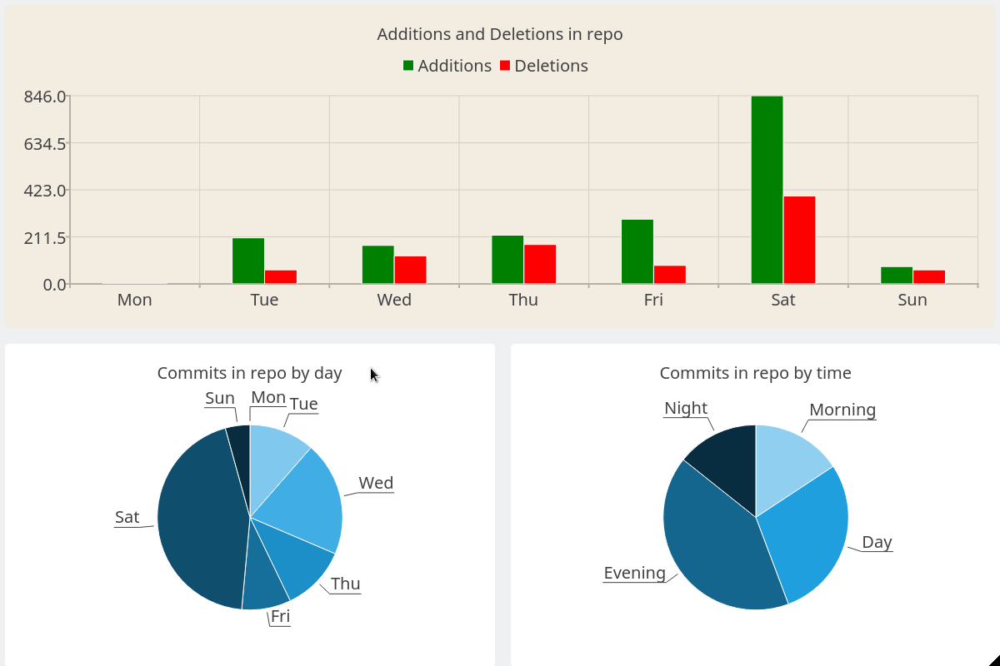
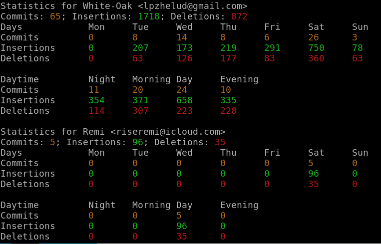
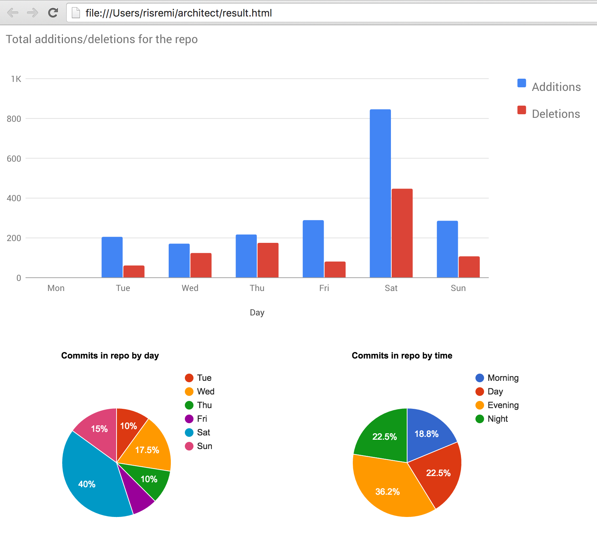

# Architect

A program that analyzes all commits in a given repo and provides statistics on commits, additions and deletions
per day and per daytime totally and per user.

## Screenshots

* Qt version

* Default, CLI version

* HTML version

## Requirements

For CLI and HTML versions Architect requires at least `Rust nightly 1.10` and `Cmake`.
Qt version also requires a Qt installation in a system with at least following modules: Core, Gui, Qml, Quick, Quick Controls and Charts.

## Usage

* Default, CLI: `cargo install` to install Architect as `architect` executable.
* Qt: `cargo install --features "qt"` to install Architect's GUI version based on Qt.
* HTML: `cargo install --features "html"` to install Architect's HTML version.
